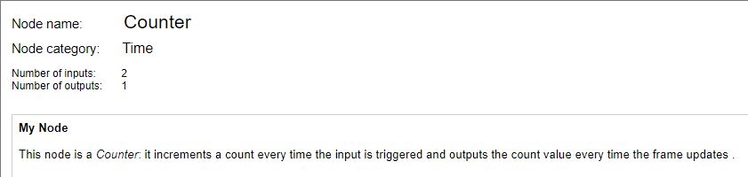

 # nBlocksStudio Counter 
 ## NODE

This node is a Counter: it increments a count every time the input is triggered and outputs the count value every time the frame updates

Inputs/Outputs
The 1st input is the Counter clock input, increments the counter.
The 2nd input Resets the Generator
The Output is the actual Counter value. 

Parameters
auto_reset: Maximum Counter Value, when the counter reaches this value auto-resets

---

 Author: Ian Aherne 

